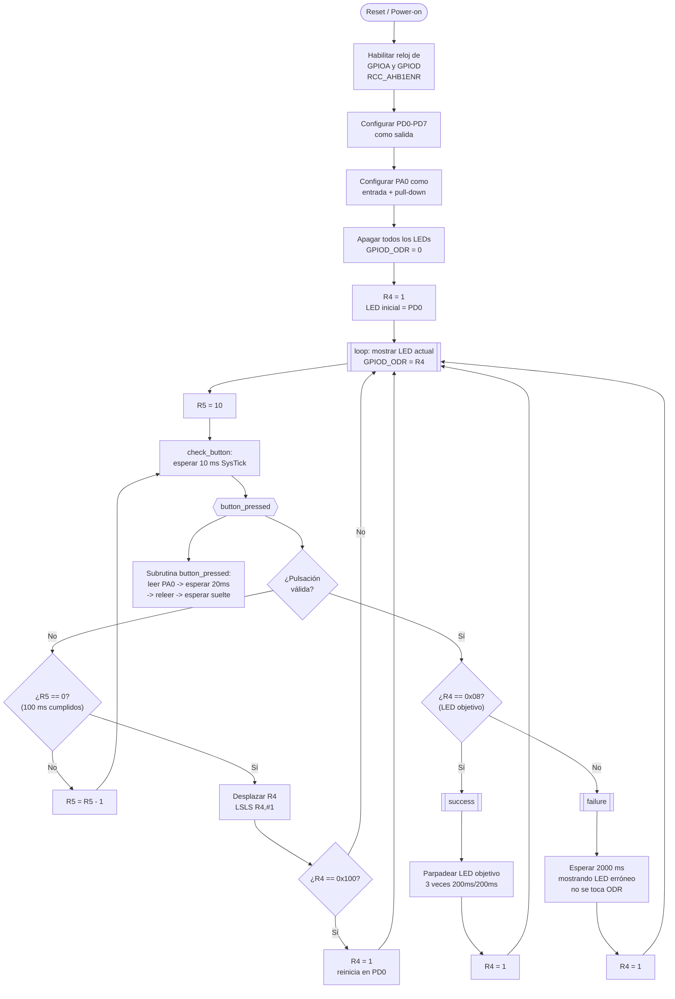
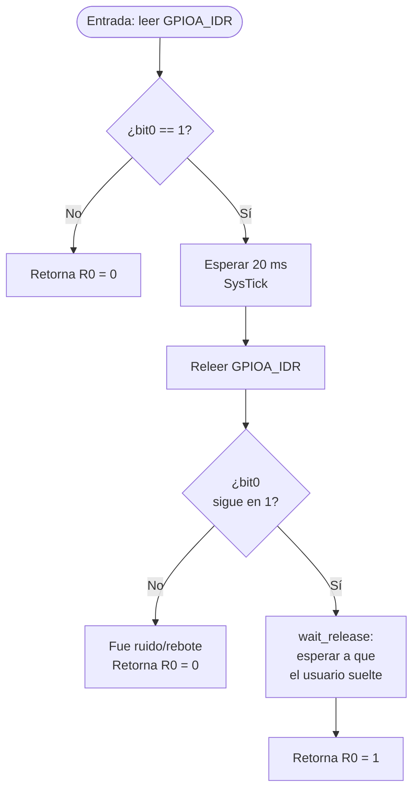

# Diagrama de Flujo

Este diagrama está en formato [Mermaid](https://mermaid.js.org/), que
GitHub renderiza automáticamente al ver este archivo en el navegador
(no requiere descargar nada ni abrir un programa externo).

## Detalle de la subrutina `button_pressed` (antirrebote)

## Correspondencia con las etiquetas del código fuente

| Bloque del diagrama | Etiqueta en `src/ruleta_precision.s` |
|---|---|
| Inicialización | `_start` (antes de `loop:`) |
| Barrido / mostrar LED | `loop`, `check_button`, `next_led` |
| Antirrebote | `button_pressed`, `wait_release`, `not_pressed` |
| Evaluación acierto/fallo | `button_event` |
| Acierto | `success`, `blink` |
| Fallo | `failure` |
| Temporización | `delay_ms`, `delay_loop`, `wait_flag` |
