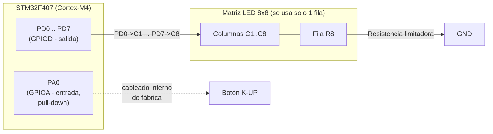
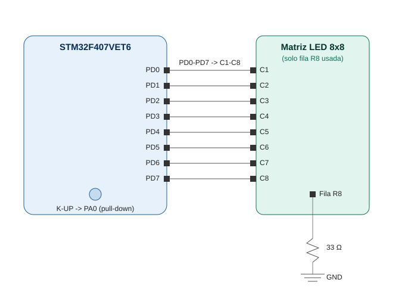

# Diagrama de Bloques de Hardware

## Distribución de pines

El arreglo de "8 LEDs" se implementa físicamente usando **una sola fila
de una matriz LED 8x8** (no los 8 LEDs discretos individuales por
separado): la fila **R8** se deja fija a GND a través de una resistencia,
y cada columna **C1–C8** de esa fila actúa como un LED independiente,
controlado directamente por PD0–PD7.

| Función | Puerto/Pin MCU | Dirección | Conexión física |
|---|---|---|---|
| LED 1 | PD0 | Salida | → C1 de la matriz |
| LED 2 | PD1 | Salida | → C2 de la matriz |
| LED 3 | PD2 | Salida | → C3 de la matriz |
| **LED 4 (objetivo)** | **PD3** | Salida | → **C4** de la matriz — columna usada como blanco del juego |
| LED 5 | PD4 | Salida | → C5 de la matriz |
| LED 6 | PD5 | Salida | → C6 de la matriz |
| LED 7 | PD6 | Salida | → C7 de la matriz |
| LED 8 | PD7 | Salida | → C8 de la matriz |
| — | Fila R8 de la matriz | — | Resistencia limitadora → GND (fila común de retorno) |
| Pulsador (N.O.) | PA0 | Entrada, pull-down interno | Ya cableado internamente en la placa al botón **K-UP**; solo se requiere configurar el pull-down por software |

> **Nota:** el pin **PA0 ya está cableado internamente al botón K-UP**.
> No es necesario cablear ningún pulsador externo: basta con configurar
> PA0 como entrada con **pull-down interno** para que el botón funcione
> correctamente (activo en alto al presionarlo).

## Diagrama de bloques (texto)

## Diagrama de conexiones

