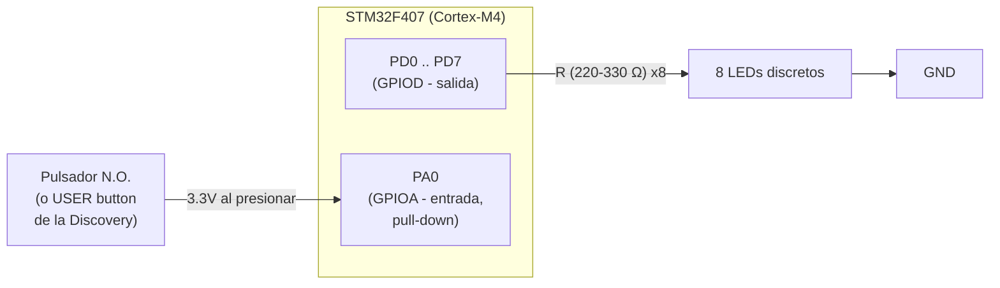

# Diagrama de Bloques de Hardware

## Distribución de pines

| Función | Puerto/Pin | Dirección | Detalle |
|---|---|---|---|
| LED 1 | PD0 | Salida | Resistencia serie (220–330 Ω) a GND |
| LED 2 | PD1 | Salida | Resistencia serie (220–330 Ω) a GND |
| LED 3 | PD2 | Salida | Resistencia serie (220–330 Ω) a GND |
| **LED 4 (objetivo)** | **PD3** | Salida | Resistencia serie (220–330 Ω) a GND — LED central usado como blanco del juego |
| LED 5 | PD4 | Salida | Resistencia serie (220–330 Ω) a GND |
| LED 6 | PD5 | Salida | Resistencia serie (220–330 Ω) a GND |
| LED 7 | PD6 | Salida | Resistencia serie (220–330 Ω) a GND |
| LED 8 | PD7 | Salida | Resistencia serie (220–330 Ω) a GND |
| Pulsador (N.O.) | PA0 | Entrada, pull-down interno | Conecta a 3.3V al presionar (activo en alto) |

> **Nota:** la tarjeta STM32F407VG Discovery trae un botón azul
> ("USER button") ya cableado a PA0 en configuración activa en alto,
> compatible con esta configuración de pull-down. Puede usarse ese
> botón integrado sin necesidad de cablear uno externo.

## Diagrama de bloques (texto)



## Espacio para el diagrama de conexiones (esquemático)

Sube aquí tu diagrama de conexiones eléctricas (Fritzing, KiCad, a mano
escaneado, etc.). Guarda la imagen en:

```
docs/img/diagrama_conexiones.png
```

y luego reemplaza esta línea por la imagen, así:

```markdown

```

<!-- ⬇️ PENDIENTE: reemplazar este bloque una vez subas tu imagen ⬇️ -->

> 🔲 **Espacio reservado — diagrama de conexiones aún no subido.**
> Coloca el archivo de imagen en `docs/img/diagrama_conexiones.png` y
> descomenta/edita la línea de arriba para mostrarlo en este documento.

<!-- ⬆️ ------------------------------------------------------------ ⬆️ -->
